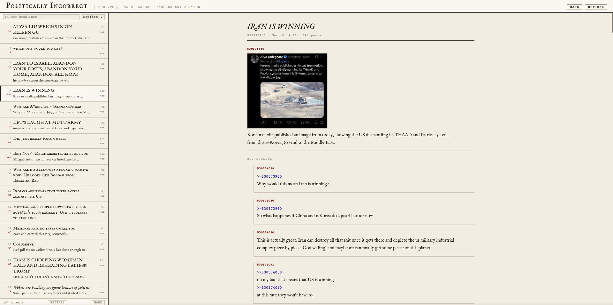

<div align="center">


# The /pol/ Board Reader 

A calm, newspaper-style reader for 4chan's /pol/ board.  
No accounts. No tracking. One HTML file.



</div>

---

## What it is

A single self-contained HTML file that reads the 4chan public API and presents /pol/ as a clean broadsheet newspaper. Split-pane layout: thread list on the left, thread content on the right. Designed to be readable, printable, and quiet.

## Features

- Split-pane layout -- threads on the left, content on the right
- Automatic thread classification: news headlines vs generals vs plain threads
- Live search filter on the thread list
- Sort by recent activity, reply count, or image count
- Dark and light mode, persisted across sessions
- Lazy image loading -- images load as you scroll
- Click image to expand inline, hover to preview
- Print stylesheet -- clean black and white output
- Custom filter system with plain text and regex support

## Filters

Open **Options** in the top right.

- **Hide Generals** -- removes recurring general threads from the list
- **Hide Tripfags** -- removes any thread or post with a tripcode
- **Custom filters** -- add patterns against Subject, Comment, Name, or Tripcode fields

Patterns are case-insensitive by default. Wrap in `/pattern/flags` for regex:

```
porn          matches porn, Porn, PORN
/^!/          matches any tripcode (all tripcodes start with !)
slide         matches slide thread, slidefag, etc.
```

Filters persist via localStorage.

## Adjustable settings (in the source)

| What | Where |
|---|---|
| Posts loaded per chunk | `const POST_CHUNK = 100` |
| Threads shown per page | `const PER_PAGE = 60` |
| Thumbnail display size | `.post-img img { max-width / max-height }` |
| Hover preview size | `max-width:600px;max-height:600px` in `expandImg` |

## Proxies

4chan's API does not allow direct browser requests due to CORS. The reader tries three public proxies in order and falls back automatically if one rate-limits:

1. api.codetabs.com
2. api.allorigins.win
3. corsproxy.io

Images load directly from `i.4cdn.org` -- no proxy needed.

## Notes

- Content is from 4chan.org via their public read-only API
- Not affiliated with 4chan or Yotsuba
- The proxy services are third-party and outside this project's control
- If all proxies fail, wait a few minutes and refresh

## License

Do whatever you want with it.
